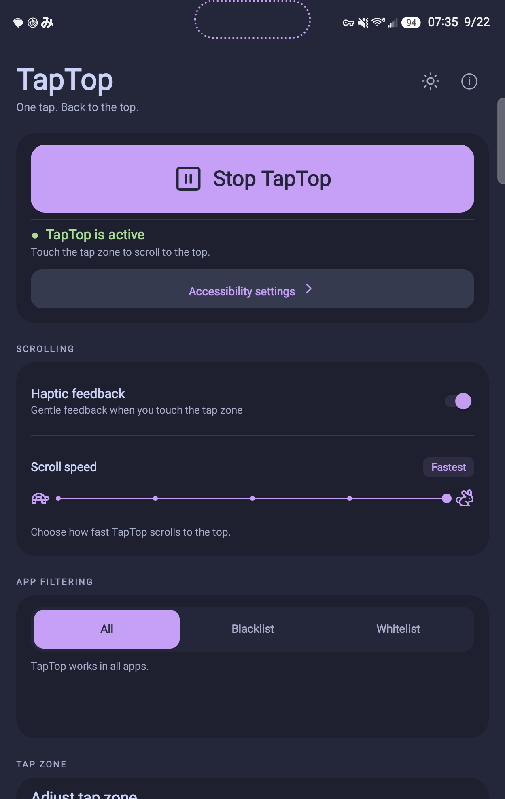
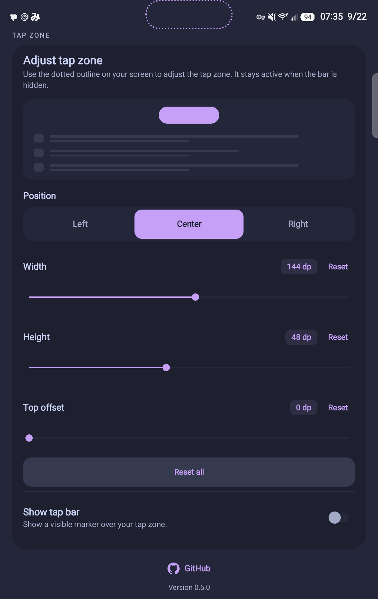

# TapTop

**One tap. Back to the top.**

Tap your chosen area to scroll to the top. Touch the screen to stop.

Version **0.6.0** · Android **8.0+**

[](https://apps.obtainium.imranr.dev/redirect?r=obtainium%3A%2F%2Fapp%2F%257B%2522id%2522%253A%2522com.taptop.app%2522%252C%2522url%2522%253A%2522https%253A%252F%252Fgithub.com%252Ftitandrive%252Ftaptop%2522%252C%2522author%2522%253A%2522TitanDrive%2522%252C%2522name%2522%253A%2522TapTop%2522%257D)
[](https://github.com/titandrive/taptop/releases/latest)

**Upgrading from 0.5.x:** TapTop now uses `com.taptop.app` and installs as a separate app. Enable its accessibility service and set up your preferences, shortcuts, and automations again. Disable the previous app’s accessibility service to avoid overlapping tap zones. In Obtainium, add TapTop using the button above.

## Screenshots

<p>
  <a href="docs/screenshots/main-controls-wide-zone.png"></a>
  <a href="docs/screenshots/tap-zone-settings-wide-zone.png"></a>
</p>

## Install and get started

1. Download **TapTop.apk** from the [latest release](https://github.com/titandrive/taptop/releases/latest), or use the Obtainium button above.
2. Open the APK. If Android blocks installation, tap **Settings** and enable **Allow from this source** for the app opening it (your browser, file manager, or Obtainium). You can also search Android Settings for **Install unknown apps**. Return to the APK and tap **Install**. [Android instructions](https://support.google.com/pixelphone/answer/7391672)
3. Open TapTop, tap **Accessibility settings**, and enable **TapTop** under **Installed apps** or **Downloaded apps** (wording varies by phone).
4. Return to TapTop and tap **Start TapTop**. Touch the tap zone to scroll to the top; touch the screen to stop.

<details>
<summary>Installation or accessibility blocked?</summary>

- **Samsung Auto Blocker:** if it blocks the APK, open **Settings → Security and privacy → Auto Blocker** and turn it off to install. You can restore it afterward; future APK updates may need it off again. [Samsung instructions](https://www.samsung.com/sg/support/mobile-devices/protect-your-galaxy-device-with-the-new-auto-blocker-feature/)
- **Restricted accessibility settings:** open **Settings → Apps → TapTop → ⋮ → Allow restricted settings**, confirm your identity if prompted, then return to Accessibility and enable TapTop. Only grant this access to apps you trust. [Android instructions](https://support.google.com/android/answer/12623953)
- **Unverified developer blocked:** this is separate from the usual unknown-app permission. If your phone specifically requires it, enable **Developer options** by tapping **Build number** seven times under **About phone** (on Samsung, **About phone → Software information**). In **Developer options**, choose **Allow apps from unverified developers** and follow Android’s prompts, including its 24-hour security delay. Then retry installation. This option is not needed for ordinary APK installs; availability depends on your device and rollout. USB debugging is not required. [Google’s current instructions](https://support.google.com/android/answer/17588095)

</details>

## Make it yours

- **Five speeds:** Slowest, Slow, Medium, Fast, Fastest.
- **Adjustable tap zone:** change its width, height, position, and top offset.
- **Optional visible bar:** choose a color and opacity, or hide it. The hidden area still works; a dotted outline helps you adjust it inside TapTop.
- **Light and dark themes:** Catppuccin Latte and Macchiato. Tap the sun/moon button to switch; hold it to follow the system.
- **Optional haptics:** feedback when tapping the area or the enable/disable button.

## App filtering

- **All:** TapTop works in every app.
- **Blacklist:** TapTop works everywhere except the apps you select.
- **Whitelist:** TapTop works only in the apps you select. An empty list disables it everywhere.

Tap **Choose blocked apps** or **Choose allowed apps** to edit the list. Search by app name; selected apps appear in their own section at the top. **Select all** selects every app, including those hidden by search. **Clear** deselects everything. Tap **Done** to save or **Cancel** to discard changes.

Both lists are saved separately. Excluded apps have no tap zone and cannot be scrolled by shortcuts or automation. Newly installed apps appear when you return to TapTop; select them if you want to add them to a list.

## Automation and shortcuts

Control TapTop from its app-icon shortcuts, Quick Settings tile, a compatible launcher or gesture app, or automation broadcasts. The app’s **ⓘ button** includes copyable intent fields.

### Available actions

| Shortcut | Intent action | Behavior |
| --- | --- | --- |
| **Toggle TapTop** | `com.taptop.app.action.TOGGLE` | Switch on/off. |
| **Turn on TapTop** | `com.taptop.app.action.TURN_ON` | Turn on; leave it on if already enabled. |
| **Turn off TapTop** | `com.taptop.app.action.TURN_OFF` | Turn off; leave it off if already disabled. |
| **Scroll to top** | `com.taptop.app.action.SCROLL_TO_TOP` | Scroll the foreground app using your selected speed and app-filter rules. |

Turning on requires TapTop’s accessibility service to be enabled and connected. Turning off also works when the service is disconnected. These actions control TapTop’s master switch; they do not enable or disable Android’s accessibility permission.

Scrolling requires both TapTop and its accessibility service to be enabled. It does not turn TapTop on automatically. Touch the screen to stop scrolling.

### Launcher and gesture shortcuts

Long-press the **TapTop app icon** to see the four actions. Supported launchers also let you place them on the home screen. In gesture apps that offer a shortcut picker, choose a TapTop action instead of launching the main app. Availability and menu names depend on the launcher or gesture app.

### Quick Settings

Edit your notification shade’s Quick Settings tiles and add **TapTop**. Tap the tile to toggle on/off. The tile requires the accessibility service to be connected.

### Tasker and MacroDroid intents

Add a **Send Intent** action to your task or macro, then enter:

| Field | Value |
| --- | --- |
| Action | One complete intent action from the table above |
| Package | `com.taptop.app` |
| Class | `com.taptop.app.AutomationReceiver` |
| Target in Tasker | **Broadcast Receiver** |
| Target in MacroDroid | **Broadcast** |
| Category, MIME type, data, extras | Leave empty / None |

For example, use `com.taptop.app.action.TURN_ON` when entering a chosen mode and `com.taptop.app.action.TURN_OFF` when leaving it. Fixed on/off actions are preferable to Toggle when an automation may run more than once.

See the [Tasker intent guide](https://tasker.joaoapps.com/userguide/en/intents.html) or [MacroDroid Send Intent reference](https://macrodroidforum.com/wiki/index.php/Action:_Send_Intent) for their intent editors.

<details>
<summary>ADB examples for all four intents</summary>

Run these from a computer with ADB connected to your phone. USB or wireless debugging is needed for these examples, not for ordinary TapTop shortcuts or automation broadcasts.

```sh
# Toggle on/off
adb shell am broadcast -a com.taptop.app.action.TOGGLE -n com.taptop.app/.AutomationReceiver

# Turn on
adb shell am broadcast -a com.taptop.app.action.TURN_ON -n com.taptop.app/.AutomationReceiver

# Turn off
adb shell am broadcast -a com.taptop.app.action.TURN_OFF -n com.taptop.app/.AutomationReceiver

# Scroll the foreground app to the top
adb shell am broadcast -a com.taptop.app.action.SCROLL_TO_TOP -n com.taptop.app/.AutomationReceiver
```

</details>

## Privacy & compatibility

TapTop uses accessibility access to scroll the current app. It has no internet permission and does not save screen content. Scrolling behavior depends on the app; some apps may not respond.

<details>
<summary>Build from source</summary>

Use Android Studio, or JDK 17 with Android SDK 34:

```sh
./gradlew assembleDebug
```

APK: `app/build/outputs/apk/debug/app-debug.apk`

For signed releases, see [release build instructions](docs/RELEASING.md).

</details>

## AI Disclaimer

TapTop was vibecoded using Codex. Use at your own discretion, and [report issues](https://github.com/titandrive/taptop/issues) when something breaks.

## License

[MIT](LICENSE) © 2026 TitanDrive. See [third-party notices](THIRD_PARTY_NOTICES.md) for included assets.
